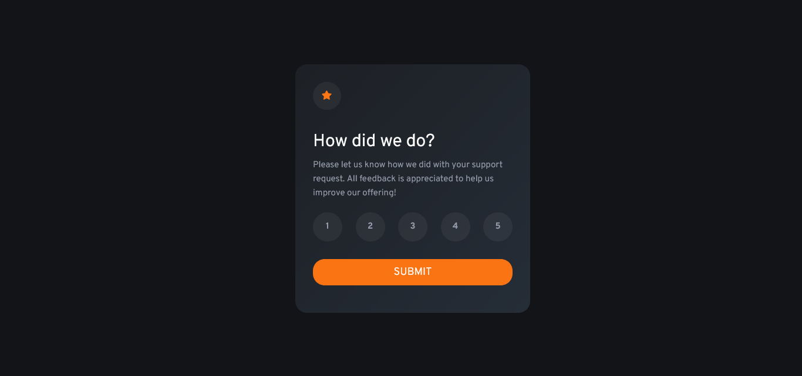

# Frontend Mentor - Interactive Rating Component solution

This is a solution to the [Interactive Rating Component challenge on Frontend Mentor](https://www.frontendmentor.io/challenges/interactive-rating-component-koxpeBUmI). Frontend Mentor challenges help you improve your coding skills by building realistic projects. 

## Table of contents

- [Overview](#overview)
  - [The challenge](#the-challenge)
  - [Screenshot](#screenshot)
  - [Links](#links)
- [My process](#my-process)
  - [Built with](#built-with)
  - [Continued development](#continued-development)
- [Author](#author)

## Overview

### The challenge

Users should be able to:

- View the optimal layout depending on their device's screen size
- See hover and focus states for interactive elements

### Screenshot

### Links

- Solution URL: [Frontend Mentor Solution](https://www.frontendmentor.io/solutions/vanilla-javascript-sass-and-mobile-first-workflow-QXlWRoJ6vM)
- Live Site URL: [See live version here](https://juan-peixoto.github.io/frontendmentor-interactive-rating-component/)

## My process

### Built with

- Semantic HTML5 markup
- CSS custom properties
- Flexbox
- Mobile-first workflow
- SASS pre processor
- Google Fonts
- Vanilla Javascript

## Author
- Frontend Mentor - [@Juan-Peixoto](https://www.frontendmentor.io/profile/Juan-Peixoto)
- Linkedin - [Juan Peixoto](https://www.linkedin.com/in/juanpeixoto1998)
